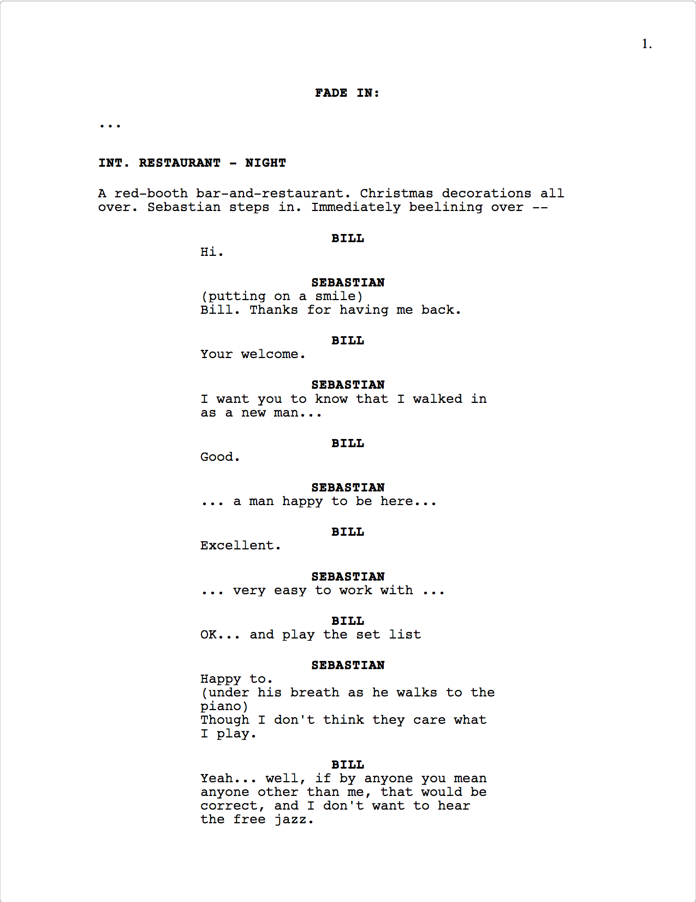

##### Project site: https://github.com/cloudwalkerfre/DreamScript

---

##### A movie script writing tool (MAC only & ENGLISH only )

---

It's usable now, but still under development...

---
Demo:

Standard movie script format.

---
Basic use: pretty much like Final Draft, short-cut:

- ctrl+1: Scene
- ctrl+2: Action
- ctrl+3: Character
- ctrl+4: Parethetical
- ctrl+5: Dialogue
- ctrl+6: Transition
- ctrl+7: Shot

Print: command+p, you can print your script as PDF (It's chrome's build-in function, I only CSS-optimized it as: US Letter)

---

*TRY TO:*  
- As simple as possible
- Just writing, no bullshit
- .fdx convert

---

**based-on**:  
~~`electron`~~ `REACT` `mobx` `nedb`

---

**mobx script**:  

    {script:
      {
        titlePage:
        {
          Title: 'LA LA LAND',
          By-line: 'Damien Chazelle'
        },
        Paragraphs: [
          ...
          {$Type: 'General'},
          {$Type: 'Action', _ :
            'Mia gathers her nerves. Gets up. And steps in.'
          },
          ...
          {$Type: 'Scene Heading' , _ :
          {
            Location: 'INI. AUDITION OFFICE',
            Time: 'AFTERNOON'
          },
          ...
          {$Type: 'Shot', _ :
            'WE RETURN to the AUDITION ROOM... Brandt and Frank waiting...'
          },
          ...
          },
          {$Type: 'Character', _ :  
            'MIA'
          },
          {$Type: 'Dialogue', _ :
            "
              Here's to the ones who dream, Foolish as they may seem. Here's to the hearts that ache. Here's to the mess we make...
            "
          },
          ...
        ]
      }
    }
